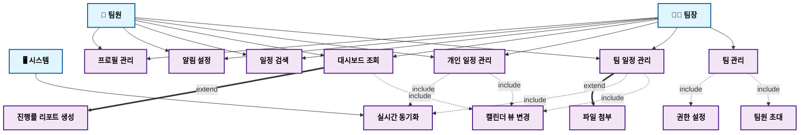

# ScheduleTree Use Case Diagram

## 시스템 유스케이스 다이어그램

## 관계 설명

### **Include 관계 (필수 관계) - 점선 화살표**
- **팀 관리**는 **팀원 초대**와 **권한 설정**을 **포함**합니다.
- **팀 일정 관리**와 **개인 일정 관리**는 **캘린더 뷰 변경**을 **포함**합니다.
- **팀 일정 관리**와 **개인 일정 관리**는 **실시간 동기화**를 **포함**합니다.
- **대시보드 조회**는 **캘린더 뷰 변경**을 **포함**합니다.

### **Extend 관계 (선택 관계) - 굵은 점선 화살표**
- **팀 일정 관리**의 확장으로 **파일 첨부**가 존재합니다.
- **대시보드 조회**의 확장으로 **진행률 리포트 생성**이 존재합니다.

### **액터 권한**
- **🧑‍💼 팀장**: 모든 기능 사용 가능
- **👥 팀원**: 팀 관리 관련 기능 제외하고 대부분의 기능 사용 가능
- **🖥️ 시스템**: 실시간 동기화 담당
