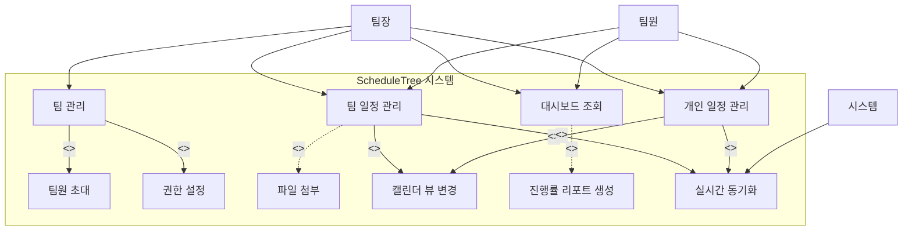

# ScheduleTree Use Case Diagram

## 시스템 유스케이스 다이어그램

```mermaid
graph TD
    A[팀장]
    B[팀원]
    C[시스템]
    
    subgraph ScheduleTree 시스템
        D[팀 관리]
        E[팀원 초대]
        F[권한 설정]
        
        G[팀 일정 관리]
        H[파일 첨부]
        
        I[개인 일정 관리]
        J[캘린더 뷰 변경]
        
        K[대시보드 조회]
        L[진행률 리포트 생성]
        
        M[실시간 동기화]
    end
    
    %% 관계 정의
    D -->|<<include>>| E
    D -->|<<include>>| F
    
    G -->|<<include>>| J
    G -.->|<<extend>>| H
    
    I -->|<<include>>| J
    
    K -.->|<<extend>>| L
    
    G -->|<<include>>| M
    I -->|<<include>>| M
    
    %% 액터-유스케이스 관계
    A --> D
    A --> G
    A --> I
    A --> K
    
    B --> G
    B --> I
    B --> K
    
    C --> M
```

## 관계 설명
- **<<include>>**: 필수 관계 (A를 수행하려면 반드시 B 수행)
- **<<extend>>**: 선택 관계 (특정 조건에서만 확장 수행)
